# 🏥 Hoan My Portal - Technical Documentation & Architecture Deep Dive

This document provides an in-depth, technical explanation of the architecture, design patterns, core subsystems, and implementation details of the **Hoan My Portal** frontend application.

---

## 🏗️ 1. Architectural Overview & Project Structure

The project is built on **Angular 19** using standalone components and structured around a highly modular, decoupled architecture. This separates core services, page layout shells, reusable shared utilities/UI elements, and business features.

The repository follows a clean folder structure:

*   [src/app/core/](file:///c:/Users/pgh001-pxl/Downloads/Hoanmy/dashboardTest/src/app/core) — Contains singleton services, global configs, security guards, interceptors, data models, and caching strategies.
*   [src/app/layouts/](file:///c:/Users/pgh001-pxl/Downloads/Hoanmy/dashboardTest/src/app/layouts) — Contains layout shell components for the application (e.g., authenticated dashboard shell vs. unauthenticated login/forgot password layout).
*   [src/app/features/](file:///c:/Users/pgh001-pxl/Downloads/Hoanmy/dashboardTest/src/app/features) — Houses lazy-loaded feature modules containing business logic and UI (Dashboards, Equipment, Clinical Reports, Settings, etc.).
*   [src/app/shared/](file:///c:/Users/pgh001-pxl/Downloads/Hoanmy/dashboardTest/src/app/shared) — Contains presentation-only UI components (tables, charts, modal overlays, forms), custom directives, pipes, and helper utilities.

### Component Dependency Diagram

```mermaid
graph TD
    AppRouting[app.routes.ts] --> AuthLayout[auth-layout.component]
    AppRouting --> MainLayout[main-layout.component]
    
    MainLayout --> Header[header.component]
    MainLayout --> Sidebar[sidebar.component]
    MainLayout --> ActionFooter[action-footer.component]
    MainLayout --> AiChatWidget[ai-chat.component]
    
    Features[features/*] -.-> LazyLoad
    LazyLoad --> Home[home.component]
    LazyLoad --> Equipment[device-list.component]
    LazyLoad --> Reports[emr-export.component, bed-usage.component, etc.]
    
    Features --> SharedComponents[shared/components/*]
    SharedComponents --> ReusableTable[reusable-table.component]
    SharedComponents --> ChartCard[chart-card.component]
    SharedComponents --> DynamicForm[dynamic-form.component]
    SharedComponents --> DateFilter[date-filter.component]
    
    Features --> CoreServices[core/services/*]
    CoreServices --> AuthService[auth.service.ts]
    CoreServices --> PdfService[pdf.service.ts]
    CoreServices --> LlmService[llm.service.ts]
    CoreServices --> ShortcutService[keyboard-shortcut.service.ts]
```


### 🔁 Routing & State Preservation
The routing system is defined in [app.routes.ts](file:///c:/Users/pgh001-pxl/Downloads/Hoanmy/dashboardTest/src/app/app.routes.ts) and leverages the following mechanisms:
*   **Lazy Loading**: Feature components are loaded dynamically via `loadComponent: () => import(...)` to optimize initial bundle size.
*   **Permission Metadata**: Routes specify required RBAC strings (e.g., `permission: 'QLThietBi.DMThietBi'`) mapped to user entitlements.
*   **Route Reuse**: The custom [CustomRouteReuseStrategy](file:///c:/Users/pgh001-pxl/Downloads/Hoanmy/dashboardTest/src/app/core/strategies/custom-route-reuse-strategy.ts) caches specific heavy dashboard routes (`'home'` and `'equipment/catalog'`) using a static `storedHandles` Map.
    *   **LRU Eviction**: To prevent memory leaks during long-running sessions, the strategy enforces a maximum cache capacity of 5 entries, automatically deleting the oldest cached handle upon violation.
    *   **Cache Busting**: Provides a static `clearCache(path)` method and `clearAllHandles()` (called by [AuthService](file:///c:/Users/pgh001-pxl/Downloads/Hoanmy/dashboardTest/src/app/core/services/auth.service.ts) during logout) to manually purge cached UI states.

---

## ⚡ 2. Reactive State Management

State is managed reactively using **Angular 19 Signals** combined with **RxJS Observables** for asynchronous event streams:

1.  **Signals (`signal`, `computed`, `effect`)**: Used for synchronous, template-bound state management that triggers granular change detection. Examples include user credentials, layout visibility toggles, loading indicators, active filters, and color palette preferences.
2.  **RxJS Streams**: Used for event-based logic, HTTP requests, stream chunk decoding (in AI chat), and window event observation (in shortcut services).

> [!TIP]
> Standardizing on signals for component properties reduces component change detection cycles (`ChangeDetectionStrategy.OnPush`) and removes the need for manual zone triggers in simple data bindings.

---

## 🔒 3. Security, Session & RBAC Subsystems

### 🔑 Authentication Architecture
The [AuthService](file:///c:/Users/pgh001-pxl/Downloads/Hoanmy/dashboardTest/src/app/core/services/auth.service.ts) manages user sessions:
*   **Synchronous Hydration**: During bootstrap, [AuthService](file:///c:/Users/pgh001-pxl/Downloads/Hoanmy/dashboardTest/src/app/core/services/auth.service.ts) reads JWT tokens from `localStorage`/`sessionStorage` to restore session state immediately.
*   **Dynamic Navigation Tree Generation**: Calls to `fetchAndSetPermissions` retrieve the user's permission nodes from the backend API. It compiles hierarchical menu items dynamically using a recursive `buildNavTree()` method, resolving order, icons, and page links.

### 🛑 Security Guards
*   [authGuard](file:///c:/Users/pgh001-pxl/Downloads/Hoanmy/dashboardTest/src/app/core/guards/auth.guard.ts): Validates if the user is authenticated, passing the current URL as `returnUrl` in the query params to enable post-login redirection.
*   [permissionGuard](file:///c:/Users/pgh001-pxl/Downloads/Hoanmy/dashboardTest/src/app/core/guards/permission.guard.ts): Performs **prefix-based matching** on permissions. If a route requires `'QLThietBi.DMThietBi'`, a user having permission `'QLThietBi.DMThietBi.View'` will be granted access.

### 🔄 HTTP Interceptor Pipeline
The application uses functional interceptors to inject headers:
1.  [authInterceptor](file:///c:/Users/pgh001-pxl/Downloads/Hoanmy/dashboardTest/src/app/core/interceptors/auth.interceptor.ts): Appends the standard authorization header:
    ```http
    Authorization: Bearer <access_token>
    ```
    It also intercepts HTTP `401 Unauthorized` errors to force-logout the user and redirect them to the login screen.
2.  [idTokenInterceptor](file:///c:/Users/pgh001-pxl/Downloads/Hoanmy/dashboardTest/src/app/core/interceptors/id-token.interceptor.ts): Appends custom identity headers for modifying actions (POST, PUT, DELETE) while skipping authentication and LLM proxy calls:
    ```http
    id_token: <id_token>
    id_user: <user_id>
    ```

---

## ⌨️ 4. Keyboard Shortcuts Engine

The global shortcut pipeline is handled by the [KeyboardShortcutService](file:///c:/Users/pgh001-pxl/Downloads/Hoanmy/dashboardTest/src/app/core/services/keyboard-shortcut.service.ts):

### 🚀 Performance Optimization
Rather than binding event listeners inside Angular's default context (which would execute change detection on every keystroke, leading to UI lag), the listener is initialized outside:
```typescript
this.ngZone.runOutsideAngular(() => {
  const sub = fromEvent<KeyboardEvent>(window, 'keydown').subscribe(event => {
    this._keyDown$.next(event);
  });
});
```
The service only enters the Angular Zone (via `ngZone.run`) when a registered, active shortcut matches the user's keystroke combination.

### 🛡️ Safety Guards & Filtering
The service prevents shortcut conflicts through three checks:
1.  **Input Field Interception**: It ignores shortcut triggers when a text input, dropdown, select, or `contenteditable` element is active (unless `allowInInputs` is explicitly enabled).
2.  **Modal Overlay Interception**: It blocks shortcuts if a CDK overlay backdrop or modal window is open (unless `ignoreModalCheck` is enabled) to prevent background actions.
3.  **Repeat Filtering**: Ignores continuous events generated by holding a key down (`event.repeat === true`).

### 🍎 Cross-Platform Layout Adaptations
The engine detects Apple platforms (macOS/iOS/iPadOS) dynamically using navigator checks. For shortcuts requiring `ctrlKey`, the service accepts the Command key (`metaKey`) as a replacement on Apple systems.
The helper `getShortcutDisplayString()` maps these modifiers to platform-specific symbols (⌘, ⌥) for display in tooltips.

---

## 📋 5. Core Shared Components

### 📊 Reusable Grid Table
The [ReusableTableComponent](file:///c:/Users/pgh001-pxl/Downloads/Hoanmy/dashboardTest/src/app/shared/components/reusable-table/reusable-table.component.ts) wraps Angular Material Table with custom layout behaviors:
*   **Vietnamese Paginator**: Plugs in custom `VietnamesePaginatorIntl` to localize range labels and tooltips.
*   **Dual Loading Modes**: Supports both a global spinner overlay and table-row skeleton placeholder grids.
*   **Interactive Row Selections**: Employs Angular CDK `SelectionModel` to manage checkbox multiple selection.
*   **Cell Render Templates**: Supports format types (`text`, `currency`, `date`, `status`, `actions`) with custom status chips and highlight filters for text matching.
*   **Keyboard Arrow Navigation**: Listeners capture `ArrowDown` / `ArrowUp` keys to change the active selected row and call `scrollIntoView({ behavior: 'smooth' })` to keep the active row visible.

### 📝 Dynamic Form Generator
The [DynamicFormComponent](file:///c:/Users/pgh001-pxl/Downloads/Hoanmy/dashboardTest/src/app/shared/components/dynamic-form/dynamic-form.component.ts) constructs forms programmatically based on a JSON config structure:
*   **Control Config Mapping**: Compiles configuration arrays (`FormConfig`) into Reactive Forms `FormGroup` elements. Modifiers map schema declarations to validation functions (`Validators.required`, `minLength`, `pattern`, etc.).
*   **Data Conversion**:
    *   **Currency Parsing**: Strips thousands separators (dots) and overrides decimal indicators (commas) to calculate floating-point decimals, updating values via `NumberUtils.format`.
    *   **Date Mapping**: Translates string inputs into Javascript `Date` objects for `MatDatepicker`, formatting them back to `yyyy-MM-dd` strings during form submission.
*   **Mobile Responsiveness**: Uses the Angular CDK `BreakpointObserver` layout to dynamically switch column layouts between single-column and multi-column flex rows depending on view size.

---

## 📈 6. Charting & Visualization Subsystem

The application leverages Apache ECharts inside [ChartCardComponent](file:///c:/Users/pgh001-pxl/Downloads/Hoanmy/dashboardTest/src/app/shared/components/chart-card/chart-card.component.ts).

### ⚡ Performance & Lazy Loading
*   **On-Demand Tree Shaking**: Imports ECharts components asynchronously using `Promise.all` to avoid bundling the entire ECharts library into the main vendor package.
*   **Direct Canvas Rendering**: Uses Canvas render engines for smoother frame rates on mobile devices, disabling double buffering features (`useDirtyRect`) to reduce graphics memory overhead.

### 📏 Layout & Responsiveness
*   **Legend Constraints**: Legend configs are overridden to place legends horizontally at the top, wrapped inside a scrollable box (`type: 'scroll'`). This prevents long series lists from overlapping the chart data.
*   **Responsiveness**: A `ResizeObserver` checks container dimension changes, resizing ECharts via debounce triggers. Text labels, legend padding, and grid paddings adjust dynamically based on mobile viewports.
*   **Zooming & Label Density**: When datasets grow, the system activates a horizontal `dataZoom` slider, computing interval widths dynamically to show readable axis markers.

### 🔍 Smart Legend Isolation
When a legend item is clicked, the system isolates that series rather than just hiding it:
```typescript
// Isolate series by resetting the legend state
this.chartInstance.dispatchAction({ type: 'legendAllSelect' }); // Reset
this.chartInstance.dispatchAction({ type: 'legendInverseSelect' }); // Inverse all
this.chartInstance.dispatchAction({ type: 'legendSelect', name: name }); // Select single target
```
Clicking the isolated item again restores all series, providing an intuitive way to filter chart clutter.

---

## 🤖 7. AI Chatbot & LLM Integration

The chatbot interface is split into [LlmService](file:///c:/Users/pgh001-pxl/Downloads/Hoanmy/dashboardTest/src/app/core/services/llm.service.ts) and [AiChatComponent](file:///c:/Users/pgh001-pxl/Downloads/Hoanmy/dashboardTest/src/app/shared/components/ai-chat/ai-chat.component.ts).

### 🌊 LLM Context & Streaming Response
*   **JSON Streaming**: The connection handles streaming chunks from the backend. The service parses each chunk line as JSON, appending text blocks and debouncing UI updates.
*   **Active Payload Context**: The request includes session identifiers, user messages, and portal state metadata:
    ```json
    {
      "messages": [ { "role": "user", "content": "..." } ],
      "metadata": {
        "sessionId": "...",
        "routes": [ { "key": "reports/bed-usage", "title": "Công suất giường bệnh" } ],
        "currentTheme": "dark",
        "currentUrl": "/app/home"
      }
    }
    ```

### 🛠️ Function Calling & Client Tools
The model can execute client-side commands by returning a tool call signature:
1.  `nav`: Triggers page redirection by resolving keys fuzzy-matched against current route configurations (`router.navigateByUrl`).
2.  `theme`: Programmatically switches between dark and light themes (`themeService.toggleTheme()`).

### 📱 Mobile UI Integration
To prevent common web-view navigation issues on mobile devices:
*   **History Manipulation**: Opening the chat triggers `history.pushState({ chatOpen: true }, '', location.href)`.
*   **Back Button Hijack**: If a user presses their mobile device's native Back button, a `popstate` event listener intercepts the navigation, closing the chat window instead of navigating away from the page.
*   **Viewport Click Dismissal**: An outside-click host listener closes the chat panel if a user clicks outside the chat window on desktop displays.

---

## 📄 8. Document Generation & Printing Pipeline

The application prints clinical summaries and exports files using the [PdfService](file:///c:/Users/pgh001-pxl/Downloads/Hoanmy/dashboardTest/src/app/core/services/pdf.service.ts).

### 📑 Document Generation
*   **Dynamic Templates**: The service fetches JSON templates from assets and feeds them into the `@pdfme/generator` package. It uses A4 sheets (`BLANK_PDF`) as a fallback if no background PDF is defined.

### 🖨️ Direct Printing Pipeline
Direct printing is handled via an invisible iframe:
1.  **Blob Generation**: Fetches binary PDFs from the server or merges existing files.
2.  **Iframe Injection**: Creates an iframe styled off-screen, pointing to the PDF Blob URL (`URL.createObjectURL(blob)`).
3.  **Dialog Hook**: Calls `iframe.contentWindow.print()` after rendering finishes.
4.  **Instant Promise Resolution**: Resolves the printing promise immediately when the print dialog is triggered. This prevents print buttons from getting stuck in an infinite loading state (since browsers do not reliably propagate `afterprint` events on PDF-rendered iframes).
5.  **Asynchronous Resource Cleanup**: Listens to the `afterprint` event or uses a 30-second fallback safety timer to remove the iframe and revoke the object URL after a short delay to free browser memory.

### 🤝 Multi-Document Merging
When a user selects multiple EMR records, the service uses `pdf-lib` to fetch and compile pages in memory:
```typescript
const mergedPdf = await PDFDocument.create();
for (const url of urls) {
  const arrayBuffer = await firstValueFrom(this.http.get(url, { responseType: 'arraybuffer' }));
  const pdfDoc = await PDFDocument.load(arrayBuffer);
  const copiedPages = await mergedPdf.copyPages(pdfDoc, pdfDoc.getPageIndices());
  copiedPages.forEach(page => mergedPdf.addPage(page));
}
const mergedPdfBytes = await mergedPdf.save();
```
This merges separate files into a single document, triggering the print dialog once to avoid multiple browser print dialog popups.

---

## 🎨 9. CSS Architecture & Design System

The application uses custom styling built on **SCSS and CSS Custom Properties**:

### 🌓 Theme Variable Injection
Colors are defined in [src/styles.scss](file:///c:/Users/pgh001-pxl/Downloads/Hoanmy/dashboardTest/src/styles.scss) under `$light-tokens` and `$dark-tokens` maps.
An SCSS mixin compiles these variables under the root selector:
```scss
@mixin create-theme-vars($tokens) {
  @each $key, $value in $tokens {
    --#{$key}: #{$value};
  }
}
```
Changing themes updates the `data-theme` attribute on the root HTML element, updating colors instantly.

### 📱 Responsive Layouts
CSS layout variables adapt to smaller screen sizes using media queries:
```scss
:root {
  --header-height: 52px;
  --sidebar-width: 250px;
  
  @media (max-width: 992px) {
    --header-height: 48px;
  }
  @media (max-width: 768px) {
    --header-height: 44px;
    --spacing-lg: 1rem;
  }
}
```
This ensures consistent headers, margins, and tooltips across mobile viewports, tablets, and desktop displays.

---

## 🛠️ 10. Developer Guide & Common Recipes

To help new developers start working on the project right away, follow these architectural recipes for extending or modifying the portal.

### 📊 Recipe A: Creating a New Report Page
When adding a new operational or clinical report, follow the standard page template:

1.  **Add a Routing Entry** in [app.routes.ts](file:///c:/Users/pgh001-pxl/Downloads/Hoanmy/dashboardTest/src/app/app.routes.ts):
    ```typescript
    {
      path: 'reports/new-report',
      loadComponent: () => import('./features/reports/new-report/new-report.component').then(m => m.NewReportComponent),
      canActivate: [permissionGuard],
      data: {
        permission: 'BaoCao.NewReport',
        title: 'New Clinical Report',
        keywords: ['clinical', 'new', 'report']
      }
    }
    ```
2.  **Define UI Layout** in your component HTML file (e.g. `new-report.component.html`):
    ```html
    <div class="report-page-container">
      <div class="report-header">
        <h2>New Clinical Report</h2>
        <!-- Reusable date range filter with auto-submit on initial load -->
        <app-date-filter
          [autoLoad]="true"
          (filterSubmit)="onFilterSubmit($event)">
        </app-date-filter>
      </div>

      <!-- Reusable localized table -->
      <app-reusable-table
        [data]="reportData()"
        [columns]="columns"
        [isLoading]="isLoading()"
        [totalDataLength]="totalCount()"
        [showPaginator]="true"
        (pageChanged)="onPageChange($event)">
      </app-reusable-table>
    </div>
    ```
3.  **Process Data via Signals** in your component TypeScript file:
    ```typescript
    import { Component, signal, inject } from '@angular/core';
    import { DateFilterComponent, DateRange } from '@shared/components/date-filter/date-filter.component';
    import { ReusableTableComponent, GridColumn } from '@shared/components/reusable-table/reusable-table.component';
    import { ReportService } from '@core/services/report.service';

    @Component({
      selector: 'app-new-report',
      standalone: true,
      imports: [DateFilterComponent, ReusableTableComponent],
      templateUrl: './new-report.component.html'
    })
    export class NewReportComponent {
      private reportService = inject(ReportService);

      public reportData = signal<any[]>([]);
      public isLoading = signal(false);
      public totalCount = signal(0);

      public readonly columns: GridColumn[] = [
        { key: 'id', label: 'Mã Số', sortable: true, width: '100px' },
        { key: 'name', label: 'Tên Dịch Vụ', sortable: true, width: '250px' },
        { key: 'createdDate', label: 'Ngày Tạo', type: 'date', sortable: true, width: '150px' }
      ];

      public onFilterSubmit(range: DateRange): void {
        this.isLoading.set(true);
        this.reportService.getData(range.fromDate, range.toDate).subscribe({
          next: (res) => {
            this.reportData.set(res.data);
            this.totalCount.set(res.total);
            this.isLoading.set(false);
          },
          error: () => this.isLoading.set(false)
        });
      }

      public onPageChange(event: any): void {
        // Handle server-side pagination offsets here
      }
    }
    ```

### ⌨️ Recipe B: Registering a New Keyboard Shortcut
To add a hotkey combo to the portal:

1.  **Add Configuration** in [keyboard-shortcuts.config.ts](file:///c:/Users/pgh001-pxl/Downloads/Hoanmy/dashboardTest/src/app/core/config/keyboard-shortcuts.config.ts):
    ```typescript
    export const GLOBAL_SHORTCUTS = {
      // Existing shortcuts...
      TOGGLE_ANALYTICS: { key: 'a', ctrlKey: true, altKey: true } as ShortcutInput,
    };
    ```
2.  **Subscribe to the Stream** inside a layout or component:
    ```typescript
    import { inject, DestroyRef } from '@angular/core';
    import { takeUntilDestroyed } from '@angular/core/rxjs-interop';
    import { KeyboardShortcutService } from '@core/services/keyboard-shortcut.service';
    import { GLOBAL_SHORTCUTS } from '@core/config/keyboard-shortcuts.config';

    export class MyComponent {
      private shortcutService = inject(KeyboardShortcutService);
      private destroyRef = inject(DestroyRef);

      constructor() {
        this.shortcutService
          .listen(GLOBAL_SHORTCUTS.TOGGLE_ANALYTICS)
          .pipe(takeUntilDestroyed(this.destroyRef))
          .subscribe((shortcutEvent) => {
            shortcutEvent.event.preventDefault();
            this.handleToggleAnalytics();
          });
      }
    }
    ```

### 🔐 Recipe C: Restricting View/Action Permissions
To prevent unauthorized users from viewing parts of the UI or accessing routes:

*   **To Guard a Page Route**: Assign the code prefix to the route configuration `data.permission` parameter in `app.routes.ts`. The [permissionGuard](file:///c:/Users/pgh001-pxl/Downloads/Hoanmy/dashboardTest/src/app/core/guards/permission.guard.ts) will block activation if the user lacks the matching credential.
*   **To Guard a UI Element**: Import [HasPermissionDirective](file:///c:/Users/pgh001-pxl/Downloads/Hoanmy/dashboardTest/src/app/shared/directives/has-permission.directive.ts) and apply `*appHasPermission` in HTML:
    ```html
    <!-- Show Delete button only if user possesses the QLThietBi.DMThietBi.Delete permission -->
    <button *appHasPermission="'QLThietBi.DMThietBi.Delete'" class="btn btn-danger">
      Xóa thiết bị
    </button>
    ```

### 📝 Recipe D: Defining a Form Configuration
To render an interactive layout using [DynamicFormComponent](file:///c:/Users/pgh001-pxl/Downloads/Hoanmy/dashboardTest/src/app/shared/components/dynamic-form/dynamic-form.component.ts), configure a structured config:

```typescript
import { FormConfig } from '@shared/components/dynamic-form/dynamic-form.component';

export const MY_FORM_CONFIG: FormConfig = {
  formRows: [
    {
      controls: [
        {
          controlName: 'deviceName',
          controlType: 'text',
          label: 'Tên Thiết Bị',
          value: '',
          validators: { required: true, minLength: 3 },
          validationMessages: {
            required: 'Vui lòng nhập tên thiết bị.',
            minLength: 'Tên thiết bị phải có ít nhất 3 ký tự.'
          }
        },
        {
          controlName: 'purchaseDate',
          controlType: 'date',
          label: 'Ngày Mua',
          value: new Date()
        }
      ]
    }
  ]
};
```
Pass this configuration input into `<app-dynamic-form [formConfig]="formConfig"></app-dynamic-form>` to render a validation-compliant form element.

