# 🏥 Hoan My Portal - Tài liệu Kỹ thuật & Phân tích Kiến trúc Chi tiết

Tài liệu này cung cấp giải thích chuyên sâu, chi tiết về mặt kỹ thuật đối với kiến trúc, các mẫu thiết kế (design patterns), các hệ thống con cốt lõi và chi tiết triển khai của ứng dụng frontend **Hoan My Portal**.

---

## 🏗️ 1. Tổng quan Kiến trúc & Cấu trúc Dự án

Dự án được xây dựng trên nền tảng **Angular 19** sử dụng standalone component và được cấu trúc theo mô hình kiến trúc phân lớp hướng module, tách biệt rõ ràng giữa các service dùng chung (core services), các khung bố cục trang (layout shells), các thành phần giao diện & tiện ích tái sử dụng (shared elements) và các module tính năng nghiệp vụ (business features).

Thư mục dự án tuân theo cấu trúc rõ ràng:

*   [src/app/core/](file:///c:/Users/pgh001-pxl/Downloads/Hoanmy/dashboardTest/src/app/core) — Chứa các singleton service, cấu hình global, route guard bảo mật, HTTP interceptor, data model và các chiến lược caching.
*   [src/app/layouts/](file:///c:/Users/pgh001-pxl/Downloads/Hoanmy/dashboardTest/src/app/layouts) — Chứa các layout component làm khung giao diện cho ứng dụng (ví dụ: khung dashboard sau khi đăng nhập và khung trang đăng nhập/quên mật khẩu).
*   [src/app/features/](file:///c:/Users/pgh001-pxl/Downloads/Hoanmy/dashboardTest/src/app/features) — Nơi chứa các module tính năng được tải động (lazy-loaded), bao gồm logic nghiệp vụ và giao diện (Dashboard trang chủ, Quản lý thiết bị, Báo cáo lâm sàng, Cài đặt,...).
*   [src/app/shared/](file:///c:/Users/pgh001-pxl/Downloads/Hoanmy/dashboardTest/src/app/shared) — Chứa các component giao diện thuần hiển thị (bảng biểu, biểu đồ, hộp thoại, form), các directive, pipe và các hàm tiện ích helper dùng chung.

### Sơ đồ Liên kết Component

```mermaid
graph TD
    AppRouting[app.routes.ts] --> AuthLayout[auth-layout.component]
    AppRouting --> MainLayout[main-layout.component]
    
    MainLayout --> Header[header.component]
    MainLayout --> Sidebar[sidebar.component]
    MainLayout --> ActionFooter[action-footer.component]
    MainLayout --> AiChatWidget[ai-chat.component]
    
    Features[features/*] -.-> LazyLoad
    LazyLoad --> Home[home.component]
    LazyLoad --> Equipment[device-list.component]
    LazyLoad --> Reports[emr-export.component, bed-usage.component, etc.]
    
    Features --> SharedComponents[shared/components/*]
    SharedComponents --> ReusableTable[reusable-table.component]
    SharedComponents --> ChartCard[chart-card.component]
    SharedComponents --> DynamicForm[dynamic-form.component]
    SharedComponents --> DateFilter[date-filter.component]
    
    Features --> CoreServices[core/services/*]
    CoreServices --> AuthService[auth.service.ts]
    CoreServices --> PdfService[pdf.service.ts]
    CoreServices --> LlmService[llm.service.ts]
    CoreServices --> ShortcutService[keyboard-shortcut.service.ts]
```


### 🔁 Điều phối Route & Bảo toàn Trạng thái
Hệ thống điều phối route được định nghĩa tại [app.routes.ts](file:///c:/Users/pgh001-pxl/Downloads/Hoanmy/dashboardTest/src/app/app.routes.ts) và áp dụng các cơ chế sau:
*   **Lazy Loading**: Các component tính năng được tải động thông qua khai báo `loadComponent: () => import(...)` giúp tối ưu hóa dung lượng bundle tải ban đầu.
*   **Metadata Phân quyền**: Các route chỉ định mã kiểm tra quyền RBAC (ví dụ: `permission: 'QLThietBi.DMThietBi'`) ánh khớp với danh sách quyền của người dùng.
*   **Tái sử dụng Route (Route Reuse)**: Lớp tùy biến [CustomRouteReuseStrategy](file:///c:/Users/pgh001-pxl/Downloads/Hoanmy/dashboardTest/src/app/core/strategies/custom-route-reuse-strategy.ts) thực hiện lưu tạm (caching) các route dashboard nặng (`'home'` và `'equipment/catalog'`) sử dụng một Map static `storedHandles`.
    *   **Giải phóng Bộ nhớ (LRU Eviction)**: Để ngăn chặn rò rỉ bộ nhớ (memory leaks) trong các phiên làm việc kéo dài, chiến lược này giới hạn dung lượng cache tối đa là 5 phần tử, tự động xóa bản ghi cũ nhất khi vượt ngưỡng.
    *   **Xóa Cache Chủ động**: Cung cấp hàm static `clearCache(path)` và `clearAllHandles()` (được gọi bởi [AuthService](file:///c:/Users/pgh001-pxl/Downloads/Hoanmy/dashboardTest/src/app/core/services/auth.service.ts) khi đăng xuất) để giải phóng các trạng thái UI đã cache.

---

## ⚡ 2. Quản lý Trạng thái Reactive

Trạng thái ứng dụng được quản lý phản xạ thông qua **Angular 19 Signals** kết hợp với **RxJS Observables** dành cho các luồng dữ liệu bất đồng bộ:

1.  **Signals (`signal`, `computed`, `effect`)**: Được dùng cho các trạng thái đồng bộ, liên kết trực tiếp với template giúp kích hoạt cơ chế dò tìm thay đổi (change detection) một cách tối giản và cục bộ. Ví dụ: thông tin người dùng đăng nhập, trạng thái đóng/mở sidebar, chỉ báo loading, bộ lọc ngày tháng và cấu hình palette màu sắc.
2.  **RxJS Streams**: Sử dụng cho các sự kiện bất đồng bộ như yêu cầu HTTP, giải mã phân mảnh luồng dữ liệu (trong chat AI) và lắng nghe sự kiện window (trong service phím tắt).

> [!TIP]
> Sử dụng signals cho các thuộc tính component giúp tối ưu hóa chu kỳ dò tìm thay đổi của Angular (`ChangeDetectionStrategy.OnPush`) và loại bỏ việc phải kích hoạt zone thủ công trong các liên kết dữ liệu đơn giản.

---

## 🔒 3. Hệ thống Bảo mật, Session & Phân quyền (RBAC)

### 🔑 Kiến trúc Xác thực
Lớp [AuthService](file:///c:/Users/pgh001-pxl/Downloads/Hoanmy/dashboardTest/src/app/core/services/auth.service.ts) chịu trách nhiệm quản lý phiên làm việc của người dùng:
*   **Khôi phục Phiên làm việc Đồng bộ**: Khi khởi động ứng dụng, [AuthService](file:///c:/Users/pgh001-pxl/Downloads/Hoanmy/dashboardTest/src/app/core/services/auth.service.ts) đọc JWT token từ `localStorage`/`sessionStorage` để khôi phục trạng thái đăng nhập ngay lập tức.
*   **Tạo Cây Danh mục Điều hướng Động**: Khi gọi `fetchAndSetPermissions`, ứng dụng tải danh sách nút quyền của tài khoản từ API. Hệ thống sẽ dựng cây menu động một cách đệ quy qua hàm `buildNavTree()`, tự động sắp xếp thứ tự, gán icon và đường dẫn tương ứng.

### 🛑 Route Guards Bảo vệ
*   [authGuard](file:///c:/Users/pgh001-pxl/Downloads/Hoanmy/dashboardTest/src/app/core/guards/auth.guard.ts): Kiểm tra người dùng đã đăng nhập chưa, đồng thời lưu URL hiện tại vào query parameter `returnUrl` để chuyển hướng ngược lại sau khi đăng nhập thành công.
*   [permissionGuard](file:///c:/Users/pgh001-pxl/Downloads/Hoanmy/dashboardTest/src/app/core/guards/permission.guard.ts): Thực hiện **so khớp tiền tố (prefix-based matching)** đối với danh sách quyền. Nếu route yêu cầu quyền `'QLThietBi.DMThietBi'`, người dùng có quyền `'QLThietBi.DMThietBi.View'` sẽ được chấp nhận truy cập.

### 🔄 Đường ống HTTP Interceptor
Ứng dụng sử dụng các interceptor hàm (functional interceptors) để chèn header tự động:
1.  [authInterceptor](file:///c:/Users/pgh001-pxl/Downloads/Hoanmy/dashboardTest/src/app/core/interceptors/auth.interceptor.ts): Đính kèm token xác thực chuẩn Bearer:
    ```http
    Authorization: Bearer <access_token>
    ```
    Interceptor này cũng bắt các lỗi HTTP `401 Unauthorized` để tự động đăng xuất người dùng và đưa về trang login.
2.  [idTokenInterceptor](file:///c:/Users/pgh001-pxl/Downloads/Hoanmy/dashboardTest/src/app/core/interceptors/id-token.interceptor.ts): Chèn các header định danh bắt buộc đối với các phương thức sửa đổi dữ liệu (POST, PUT, DELETE), ngoại trừ API đăng nhập và proxy AI/LLM:
    ```http
    id_token: <id_token>
    id_user: <user_id>
    ```

---

## ⌨️ 4. Bộ máy Phím tắt (Keyboard Shortcuts Engine)

Hệ thống phím tắt toàn cục được điều phối bởi [KeyboardShortcutService](file:///c:/Users/pgh001-pxl/Downloads/Hoanmy/dashboardTest/src/app/core/services/keyboard-shortcut.service.ts):

### 🚀 Tối ưu hóa Hiệu năng
Thay vì đăng ký lắng nghe sự kiện keydown trực tiếp trong vùng chạy mặc định của Angular (điều này sẽ kích hoạt cơ chế Change Detection trên mọi phím nhấn của người dùng gây giật lag giao diện), listener được khởi tạo bên ngoài:
```typescript
this.ngZone.runOutsideAngular(() => {
  const sub = fromEvent<KeyboardEvent>(window, 'keydown').subscribe(event => {
    this._keyDown$.next(event);
  });
});
```
Hệ thống chỉ quay lại vùng chạy của Angular (thông qua `ngZone.run`) khi có phím tắt đã đăng ký khớp chính xác với tổ hợp phím người dùng bấm.

### 🛡️ Bộ lọc Ngăn chặn Xung đột
Service thực hiện ba bước kiểm tra trước khi kích hoạt hành động phím tắt:
1.  **Bỏ qua khi Đang Nhập liệu**: Tự động bỏ qua phím tắt nếu người dùng đang thao tác trên các phần tử nhập liệu như input, textarea, select hoặc thẻ có thuộc tính `contenteditable` (trừ khi biến `allowInInputs` được bật).
2.  **Bỏ qua khi Mở Hộp thoại (Modal)**: Tạm dừng phím tắt toàn cục nếu phát hiện có hộp thoại hoặc CDK backdrop đang hiển thị (trừ khi bật `ignoreModalCheck`) nhằm tránh kích hoạt các tác vụ chạy nền dưới modal.
3.  **Lọc phím Nhấn giữ**: Bỏ qua các sự kiện liên tục phát sinh do người dùng nhấn giữ phím lâu (`event.repeat === true`).

### 🍎 Tương thích Đa nền tảng
Hệ thống tự động phát hiện thiết bị Apple (macOS/iOS/iPadOS). Đối với các phím tắt yêu cầu phím điều khiển `Ctrl`, ứng dụng sẽ tự động ánh xạ sang phím Command (`metaKey`) trên macOS.
Hàm helper `getShortcutDisplayString()` tự động định dạng hiển thị các ký tự điều khiển thành các ký hiệu đặc trưng (⌘, ⌥) trên giao diện tooltip.

---

## 📋 5. Các Component Dùng chung Cốt lõi (Core Shared Components)

### 📊 Bảng Dữ liệu Tái sử dụng (Reusable Grid Table)
Thành phần [ReusableTableComponent](file:///c:/Users/pgh001-pxl/Downloads/Hoanmy/dashboardTest/src/app/shared/components/reusable-table/reusable-table.component.ts) bọc ngoài Angular Material Table và cung cấp các tính năng:
*   **Bản địa hóa Phân trang**: Sử dụng class `VietnamesePaginatorIntl` tùy biến để chuyển ngữ toàn bộ nhãn hiển thị và tooltip phân trang sang tiếng Việt.
*   **Chỉ báo Tải Dữ liệu kép**: Hỗ trợ hiển thị vòng quay loading overlay hoặc khung xương bảng giả lập (skeleton grid rows).
*   **Quản lý Chọn Bản ghi**: Tích hợp CDK `SelectionModel` hỗ trợ chọn nhanh một hoặc nhiều hàng qua checkbox.
*   **Template Ô Dữ liệu linh hoạt**: Cho phép cấu hình kiểu cột đa dạng (`text`, `currency`, `date`, `status`, `actions`) cùng cơ chế tô sáng (highlight) từ khóa tìm kiếm.
*   **Điều hướng bằng Phím mũi tên**: Lắng nghe phím `ArrowDown` / `ArrowUp` của bàn phím để di chuyển hàng được chọn và tự động cuộn trang (`scrollIntoView({ behavior: 'smooth' })`) để giữ hàng hoạt động luôn trong tầm nhìn.

### 📝 Trình Tạo Form Động (Dynamic Form)
Component [DynamicFormComponent](file:///c:/Users/pgh001-pxl/Downloads/Hoanmy/dashboardTest/src/app/shared/components/dynamic-form/dynamic-form.component.ts) hỗ trợ dựng giao diện nhập liệu từ cấu hình JSON:
*   **Ánh xạ Validators**: Dịch cấu hình khai báo (`FormConfig`) thành các validator tiêu chuẩn của Reactive Forms (`Validators.required`, `minLength`, `pattern`,...).
*   **Xử lý và Chuyển đổi Dữ liệu**:
    *   **Định dạng Tiền tệ**: Tự động loại bỏ dấu phân cách hàng nghìn (chấm) và chuẩn hóa dấu thập phân (phẩy) sang dạng float để lưu trữ, đồng thời cập nhật hiển thị qua `NumberUtils.format`.
    *   **Kiểu ngày tháng**: Chuyển đổi chuỗi string từ API thành đối tượng `Date` của Javascript cho `MatDatepicker` hiển thị, và tự động parse ngược lại thành định dạng chuỗi `yyyy-MM-dd` khi submit form.
*   **Tự thích ứng Giao diện (Responsive)**: Sử dụng thư viện `BreakpointObserver` của Angular CDK để tự động chuyển đổi cấu trúc hiển thị từ dạng nhiều cột (màn hình lớn) sang dạng một cột dọc (trên thiết bị di động).

---

## 📈 6. Hệ thống Biểu đồ & Trực quan hóa Dữ liệu (Charting Subsystem)

Ứng dụng tích hợp thư viện đồ họa Apache ECharts thông qua component bao bọc [ChartCardComponent](file:///c:/Users/pgh001-pxl/Downloads/Hoanmy/dashboardTest/src/app/shared/components/chart-card/chart-card.component.ts).

### ⚡ Tối ưu hóa Tải Động & Bộ nhớ
*   **Tải thành phần theo nhu cầu (Tree-shaking)**: Sử dụng cú pháp `Promise.all` kết hợp import động để chỉ tải các module biểu đồ thực tế cần dùng, giảm kích thước gói bundle chính.
*   **Sử dụng Canvas Renderer**: Ưu tiên dựng hình bằng Canvas trên di động để nâng cao tốc độ phản hồi và tắt tính năng vẽ lại cục bộ (`useDirtyRect`) để tiết kiệm dung lượng RAM đồ họa của thiết bị.

### 📏 Cấu hình Layout & Tự Co giãn (Responsiveness)
*   **Tránh đè nhãn chú thích (Legend Overlap)**: Cấu hình chú thích được ghi đè để luôn nằm ngang ở trên cùng biểu đồ, đặt trong thanh cuộn (`type: 'scroll'`). Cách này tránh tình trạng danh sách các chỉ mục quá dài đè lên diện tích hiển thị của cột hay đường vẽ biểu đồ.
*   **Co giãn Động**: Đăng ký một bộ theo dõi kích thước `ResizeObserver`. Khi kích thước vùng chứa thay đổi, biểu đồ sẽ thực hiện resize có debounce. Các nhãn chữ, kích thước chú thích cũng tự động nhỏ lại tương ứng trên màn hình điện thoại.
*   **Mật độ Điểm dữ liệu**: Khi tập dữ liệu quá lớn, hệ thống tự động chèn thanh trượt zoom (`dataZoom`), tính toán khoảng hiển thị phù hợp để biểu đồ không bị chồng chéo nhãn trục X.

### 🔍 Cô lập Chỉ mục Thông minh (Smart Legend Isolation)
Khi người dùng click chọn một chỉ mục trên biểu đồ, hệ thống thực hiện gom nhóm và cô lập đường vẽ đó thay vì chỉ ẩn đi thông thường:
```typescript
// Thực hiện cô lập đường vẽ bằng cách chọn duy nhất một series mục tiêu
this.chartInstance.dispatchAction({ type: 'legendAllSelect' }); // Bật tất cả
this.chartInstance.dispatchAction({ type: 'legendInverseSelect' }); // Đảo ngược chọn (Tắt tất cả)
this.chartInstance.dispatchAction({ type: 'legendSelect', name: name }); // Bật duy nhất series mục tiêu
```
Bấm lại vào chỉ mục đó lần nữa sẽ hoàn tác và hiển thị lại toàn bộ các đường vẽ ban đầu.

---

## 🤖 7. Tích hợp Trợ lý Ảo AI & LLM

Hệ thống trò chuyện tương tác thông minh được phân tách giữa [LlmService](file:///c:/Users/pgh001-pxl/Downloads/Hoanmy/dashboardTest/src/app/core/services/llm.service.ts) và [AiChatComponent](file:///c:/Users/pgh001-pxl/Downloads/Hoanmy/dashboardTest/src/app/shared/components/ai-chat/ai-chat.component.ts).

### 🌊 Ngữ cảnh LLM & Nhận dữ liệu Luồng (Stream Decoding)
*   **Giải mã JSON Stream**: Kết nối HTTP nhận dữ liệu trả về theo luồng từ máy chủ AI. Service thực hiện phân tách dòng và parse JSON liên tục để cập nhật văn bản hiển thị kèm bộ debounce làm mượt giao diện.
*   **Truyền tải Dữ liệu Ngữ cảnh**: Mỗi câu hỏi gửi đi đều đính kèm thông tin phiên làm việc, lịch sử chat gần nhất và thông tin trạng thái hoạt động của portal:
    ```json
    {
      "messages": [ { "role": "user", "content": "..." } ],
      "metadata": {
        "sessionId": "...",
        "routes": [ { "key": "reports/bed-usage", "title": "Công suất giường bệnh" } ],
        "currentTheme": "dark",
        "currentUrl": "/app/home"
      }
    }
    ```

### 🛠️ Gọi Hàm Động & Tiện ích Client (Function Calling)
Mô hình AI có khả năng gửi yêu cầu thực thi các hàm hệ thống ở phía client thông qua cấu trúc trả về đặc biệt:
1.  `nav`: Chuyển trang trong portal bằng cách so khớp gần đúng từ khóa người dùng nói với danh sách route cấu hình hệ thống (`router.navigateByUrl`).
2.  `theme`: Chuyển đổi giao diện sáng/tối tự động của ứng dụng (`themeService.toggleTheme()`).

### 📱 Tối ưu hóa Trải nghiệm Di động
Để tránh các lỗi điều hướng mặc định của trình duyệt trên điện thoại di động:
*   **Đẩy Lịch sử Trình duyệt**: Khi mở khung chat AI, ứng dụng chủ động gọi `history.pushState({ chatOpen: true }, '', location.href)`.
*   **Chặn phím Back**: Nếu người dùng bấm nút Back (quay lại) vật lý trên điện thoại, listener sự kiện `popstate` sẽ chặn hành động chuyển trang và thực hiện đóng khung chat AI thay thế.
*   **Tự động Đóng khi click ngoài**: Đăng ký một listener toàn cục để tự động thu nhỏ khung chat nếu phát hiện người dùng click ra ngoài vùng hiển thị của widget.

---

## 📄 8. Quy trình Xuất Bản & In PDF

Quy trình in ấn báo cáo lâm sàng và kết xuất tài liệu được đảm nhận bởi [PdfService](file:///c:/Users/pgh001-pxl/Downloads/Hoanmy/dashboardTest/src/app/core/services/pdf.service.ts).

### 📑 Thiết kế Tài liệu
*   **Mẫu Thiết Kế Động (Templates)**: Service tải các file cấu hình schema JSON từ thư mục assets và truyền dữ liệu tương ứng vào thư viện `@pdfme/generator` để vẽ PDF, sử dụng trang trắng A4 (`BLANK_PDF`) làm nền nếu không có file PDF mẫu.

### 🖨️ Kênh In ấn Trực tiếp
Để in tài liệu trực tiếp không qua lưu file trung gian:
1.  **Tạo Blob**: Nhận luồng nhị phân PDF từ máy chủ API hoặc từ bộ trộn file.
2.  **Chèn Iframe ẩn**: Dựng một thẻ `iframe` ẩn ngoài màn hình, trỏ thuộc tính src tới URL tạm thời của Blob (`URL.createObjectURL(blob)`).
3.  **Kích hoạt In**: Chờ tài liệu dựng xong trên DOM và gọi lệnh `iframe.contentWindow.print()`.
4.  **Giải phóng Promise Ngay lập tức**: Resolve promise in ấn ngay sau khi kích hoạt hộp thoại in. Việc này ngăn chặn việc nút in bị kẹt ở trạng thái loading vô hạn (vì trình duyệt không phát sự kiện `afterprint` một cách đáng tin cậy trên các iframe hiển thị PDF).
5.  **Giải phóng Tài nguyên Bất đồng bộ**: Lắng nghe sự kiện `afterprint` hoặc sử dụng một bộ đếm thời gian an toàn dự phòng 30 giây để gỡ bỏ iframe khỏi DOM và hủy URL Blob sau một khoảng trễ ngắn để tránh rò rỉ bộ nhớ RAM.

### 🤝 Trộn Nhiều Tài liệu PDF (PDF Merging)
Khi người dùng chọn in nhiều file EMR cùng lúc, hệ thống sử dụng thư viện `pdf-lib` để gộp trang trong bộ nhớ trước khi in:
```typescript
const mergedPdf = await PDFDocument.create();
for (const url of urls) {
  const arrayBuffer = await firstValueFrom(this.http.get(url, { responseType: 'arraybuffer' }));
  const pdfDoc = await PDFDocument.load(arrayBuffer);
  const copiedPages = await mergedPdf.copyPages(pdfDoc, pdfDoc.getPageIndices());
  copiedPages.forEach(page => mergedPdf.addPage(page));
}
const mergedPdfBytes = await mergedPdf.save();
```
Quá trình này gộp toàn bộ các trang của các file đơn lẻ thành một file lớn duy nhất, giúp hộp thoại in của hệ điều hành chỉ hiển thị một lần, nâng cao trải nghiệm của người dùng.

---

## 🎨 9. Kiến trúc CSS & Hệ thống Thiết kế (Design System)

Ứng dụng quản lý giao diện thông qua hệ thống biến tùy biến **CSS Custom Properties kết hợp SCSS**:

### 🌓 Khởi tạo Biến Chủ đề màu (Theme Vars)
Danh mục màu sắc được phân tách tại [src/styles.scss](file:///c:/Users/pgh001-pxl/Downloads/Hoanmy/dashboardTest/src/styles.scss) dưới hai bảng ánh xạ `$light-tokens` và `$dark-tokens`.
Một mixin SCSS được sử dụng để xuất các token này thành các biến toàn cục:
```scss
@mixin create-theme-vars($tokens) {
  @each $key, $value in $tokens {
    --#{$key}: #{$value};
  }
}
```
Việc thay đổi giao diện sáng/tối chỉ cần cập nhật thuộc tính `data-theme` trên thẻ HTML gốc, trình duyệt sẽ tự động cập nhật lại toàn bộ bảng màu hiển thị.

### 📱 Responsive Layout toàn cục
CSS khai báo các biến kích thước layout tự động thay đổi theo chiều rộng màn hình:
```scss
:root {
  --header-height: 52px;
  --sidebar-width: 250px;
  
  @media (max-width: 992px) {
    --header-height: 48px;
  }
  @media (max-width: 768px) {
    --header-height: 44px;
    --spacing-lg: 1rem;
  }
}
```
Điều này đảm bảo chiều cao header, độ rộng menu và khoảng đệm hiển thị luôn đồng bộ trên tất cả thiết bị di động, máy tính bảng và màn hình máy tính.

---

## 🛠️ 10. Hướng dẫn dành cho Lập trình viên & Các công thức (Recipes) thường gặp

Để các lập trình viên mới có thể bắt tay vào làm việc ngay trên dự án, dưới đây là các công thức (Recipes) chuẩn hóa để mở rộng hệ thống.

### 📊 Recipe A: Tạo một Trang Báo cáo mới
Khi cần bổ sung một báo cáo thống kê lâm sàng hoặc vận hành mới, hãy làm theo quy trình:

1.  **Khai báo Route** tại [app.routes.ts](file:///c:/Users/pgh001-pxl/Downloads/Hoanmy/dashboardTest/src/app/app.routes.ts):
    ```typescript
    {
      path: 'reports/new-report',
      loadComponent: () => import('./features/reports/new-report/new-report.component').then(m => m.NewReportComponent),
      canActivate: [permissionGuard],
      data: {
        permission: 'BaoCao.NewReport',
        title: 'Báo cáo Lâm sàng Mới',
        keywords: ['clinical', 'new', 'report']
      }
    }
    ```
2.  **Viết Giao diện HTML** (ví dụ: `new-report.component.html`):
    ```html
    <div class="report-page-container">
      <div class="report-header">
        <h2>Báo cáo Lâm sàng Mới</h2>
        <!-- Bộ lọc ngày tháng tái sử dụng, tự động tải dữ liệu ban đầu -->
        <app-date-filter
          [autoLoad]="true"
          (filterSubmit)="onFilterSubmit($event)">
        </app-date-filter>
      </div>

      <!-- Bảng hiển thị dữ liệu tái sử dụng -->
      <app-reusable-table
        [data]="reportData()"
        [columns]="columns"
        [isLoading]="isLoading()"
        [totalDataLength]="totalCount()"
        [showPaginator]="true"
        (pageChanged)="onPageChange($event)">
      </app-reusable-table>
    </div>
    ```
3.  **Triển khai Component TypeScript** xử lý dữ liệu qua Signals:
    ```typescript
    import { Component, signal, inject } from '@angular/core';
    import { DateFilterComponent, DateRange } from '@shared/components/date-filter/date-filter.component';
    import { ReusableTableComponent, GridColumn } from '@shared/components/reusable-table/reusable-table.component';
    import { ReportService } from '@core/services/report.service';

    @Component({
      selector: 'app-new-report',
      standalone: true,
      imports: [DateFilterComponent, ReusableTableComponent],
      templateUrl: './new-report.component.html'
    })
    export class NewReportComponent {
      private reportService = inject(ReportService);

      public reportData = signal<any[]>([]);
      public isLoading = signal(false);
      public totalCount = signal(0);

      public readonly columns: GridColumn[] = [
        { key: 'id', label: 'Mã Số', sortable: true, width: '100px' },
        { key: 'name', label: 'Tên Dịch Vụ', sortable: true, width: '250px' },
        { key: 'createdDate', label: 'Ngày Tạo', type: 'date', sortable: true, width: '150px' }
      ];

      public onFilterSubmit(range: DateRange): void {
        this.isLoading.set(true);
        this.reportService.getData(range.fromDate, range.toDate).subscribe({
          next: (res) => {
            this.reportData.set(res.data);
            this.totalCount.set(res.total);
            this.isLoading.set(false);
          },
          error: () => this.isLoading.set(false)
        });
      }

      public onPageChange(event: any): void {
        // Xử lý phân trang server-side tại đây
      }
    }
    ```

### ⌨️ Recipe B: Đăng ký một Phím tắt mới
Để định nghĩa một tổ hợp phím tắt mới chạy toàn hệ thống:

1.  **Thêm Cấu hình** tại [keyboard-shortcuts.config.ts](file:///c:/Users/pgh001-pxl/Downloads/Hoanmy/dashboardTest/src/app/core/config/keyboard-shortcuts.config.ts):
    ```typescript
    export const GLOBAL_SHORTCUTS = {
      // Các phím tắt hiện tại...
      TOGGLE_ANALYTICS: { key: 'a', ctrlKey: true, altKey: true } as ShortcutInput,
    };
    ```
2.  **Lắng nghe Sự kiện** trong component hoặc layout mong muốn:
    ```typescript
    import { inject, DestroyRef } from '@angular/core';
    import { takeUntilDestroyed } from '@angular/core/rxjs-interop';
    import { KeyboardShortcutService } from '@core/services/keyboard-shortcut.service';
    import { GLOBAL_SHORTCUTS } from '@core/config/keyboard-shortcuts.config';

    export class MyComponent {
      private shortcutService = inject(KeyboardShortcutService);
      private destroyRef = inject(DestroyRef);

      constructor() {
        this.shortcutService
          .listen(GLOBAL_SHORTCUTS.TOGGLE_ANALYTICS)
          .pipe(takeUntilDestroyed(this.destroyRef))
          .subscribe((shortcutEvent) => {
            shortcutEvent.event.preventDefault();
            this.handleToggleAnalytics();
          });
      }
    }
    ```

### 🔐 Recipe C: Phân quyền Giao diện & Tác vụ
Để kiểm soát quyền xem hoặc thực thi chức năng trên màn hình:

*   **Bảo vệ Đường dẫn (Route Guard)**: Điền mã tiền tố quyền vào thuộc tính `data.permission` trong cấu hình route tại file `app.routes.ts`. Lớp [permissionGuard](file:///c:/Users/pgh001-pxl/Downloads/Hoanmy/dashboardTest/src/app/core/guards/permission.guard.ts) sẽ tự động kiểm tra và chuyển hướng nếu tài khoản thiếu quyền.
*   **Bảo vệ Phần tử Giao diện**: Import directive [HasPermissionDirective](file:///c:/Users/pgh001-pxl/Downloads/Hoanmy/dashboardTest/src/app/shared/directives/has-permission.directive.ts) và sử dụng thẻ điều kiện `*appHasPermission` trong HTML:
    ```html
    <!-- Chỉ hiển thị nút Xóa nếu tài khoản sở hữu quyền QLThietBi.DMThietBi.Delete -->
    <button *appHasPermission="'QLThietBi.DMThietBi.Delete'" class="btn btn-danger">
      Xóa thiết bị
    </button>
    ```

### 📝 Recipe D: Cấu hình Form Động (Dynamic Form)
Để dựng form nhập liệu qua component [DynamicFormComponent](file:///c:/Users/pgh001-pxl/Downloads/Hoanmy/dashboardTest/src/app/shared/components/dynamic-form/dynamic-form.component.ts), hãy định nghĩa mảng cấu hình:

```typescript
import { FormConfig } from '@shared/components/dynamic-form/dynamic-form.component';

export const MY_FORM_CONFIG: FormConfig = {
  formRows: [
    {
      controls: [
        {
          controlName: 'deviceName',
          controlType: 'text',
          label: 'Tên Thiết Bị',
          value: '',
          validators: { required: true, minLength: 3 },
          validationMessages: {
            required: 'Vui lòng nhập tên thiết bị.',
            minLength: 'Tên thiết bị phải có ít nhất 3 ký tự.'
          }
        },
        {
          controlName: 'purchaseDate',
          controlType: 'date',
          label: 'Ngày Mua',
          value: new Date()
        }
      ]
    }
  ]
};
```
Truyền cấu hình này vào thẻ `<app-dynamic-form [formConfig]="formConfig"></app-dynamic-form>` trên HTML để có ngay form nhập liệu đầy đủ kiểm tra lỗi hợp lệ.
